# Chunjae Education Sub-Project
**팀원 :** `권인구` `이채민` `박은지` `손수지` `조나희`

**프로젝트 기간 :** `2024. 03. 29` - `2024. 04. 05`

**framework :**    

<br/>

| 이름    | 담당 역할                                      |
|-------|------------------------------------------------|
| 권인구 | Data-manager, Back-end |
| 이채민 | Front-end, Editor |
| 박은지 | Front-end, Editor |
| 손수지 | Data-manager, Back-end |
| 조나희 | Leader, Designer, Front-end |


<br/><br/>


# 시작 가이드
### Front-end
```
$ npm run dev
```

### Back-end
```
$ python -m venv venv
```
```
# windows
$ source venv/Scripts/activate

# mac
$ source venv/bin/activate
```
```
$ pip install -r requirements.txt
```
```
$ python manage.py runserver
```

<br/><br/>

# 재수없다(JSX) : 독학 재수생을 위한 학습 관리 시스템
### 프로젝트 개요
- **주제 :** Django와 Vue를 활용한 웹사이트 제작
- **목적**: 온라인 학습 관리를 위한 LMS 개발
- **대상 사용자**: 교육생 및 강사

</br></br>

> **“더 이상의 재수는 없다!”**

독학 재수를 하고 있는데 모르는 문제를 질문할 곳이 없어서,
자꾸 집중력이 흐려져서 고민이신가요?
>

**"재수없다"** 는 독학 재수생의 열악한 학습 환경을 개선하고, 집중력 부족 문제를 해결하며,
 저렴한 가격으로 재수 비용 부담을 줄이기 위한 밀크T 내의 신규 학습 관리 시스템

</br></br>
| 사용자 | 서비스 메인 컬러 | 서비스 로고 |
|---|---|---|
| 독학 재수생, 선생님 |  **Navy `#00068E`** |  |

</br></br>

## 서비스 목표

**자기주도적 학습**

- 독학 재수생은 자기주도적인 학습이 필요하다.
- LMS는 학생이 스스로 학습관리를 할 수 있도록 지원한다.

**학습(모의고사) 분석과 피드백**

- 각 학생은 다른 수준과 요구를 가지고 있다.
- 선생님은 1:1 피드백을 통해 문제 풀이에 대한 디테일한 노하우를 알려주고 해설을 해줌으로써 학생의 강점과 약점을 파악하여 학습의 효율을 높여준다.

**지속적인 동기부여**

- 실전 모의고사, 커뮤니티 활동, 학습관리 및 학습확인표 등을 통해 학생들의 학습 동기를 유지하고 지속적인 학습을 장려한다.

**접근성과 편의성**

- 모바일 앱(웹)을 통해 학습자들이 언제 어디서나 접근할 수 있도록 하여 학습의 편의성을 높인다.

</br></br>

## DataBase System


</br></br>

## MVP 기능 리스트
### 서비스 구성도


|        |        |        |
|--------|--------|--------|
| 메인화면 | 목표대학 설정 | 알림 |
|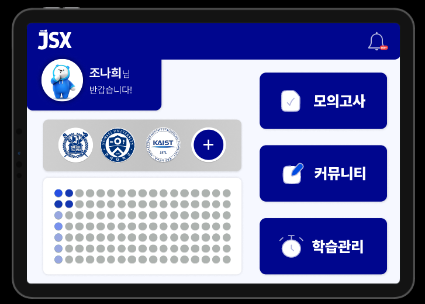|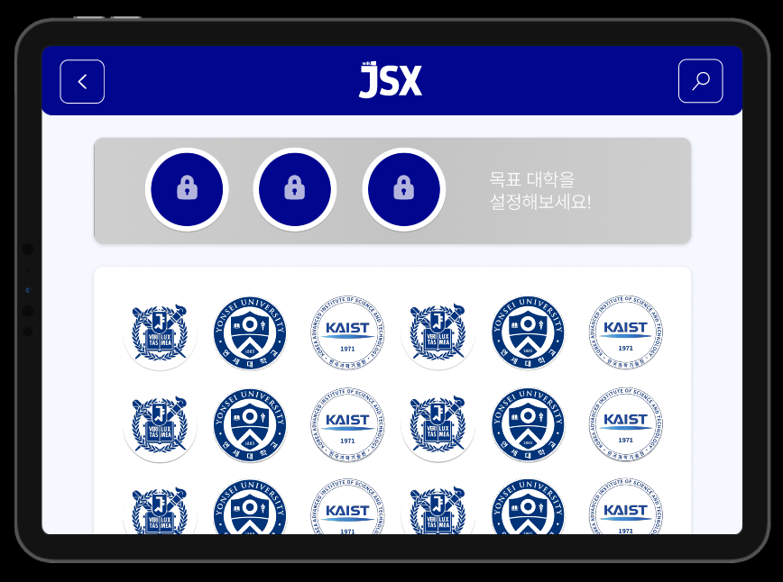|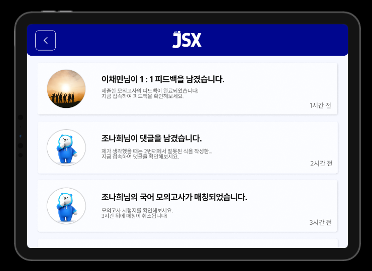|
| 모의고사(1) | 모의고사(2) | 모의고사(3) |
|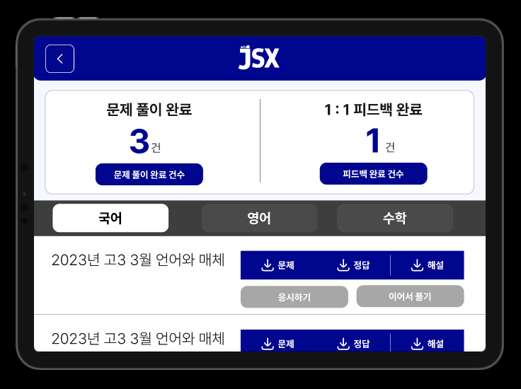|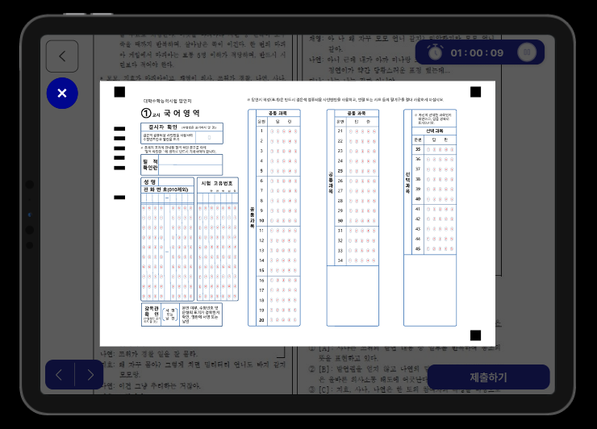|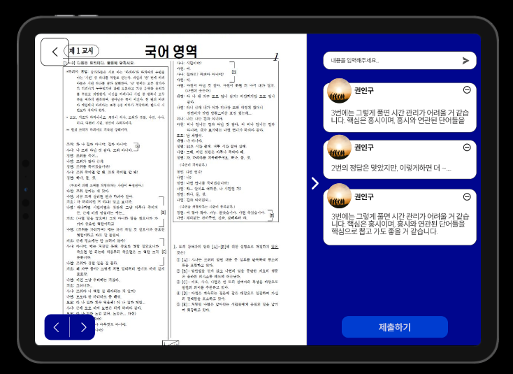|
| 커뮤니티(1) | 커뮤니티(2) | 커뮤니티(3) |
|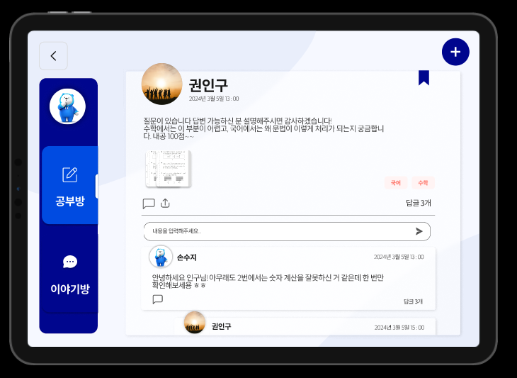|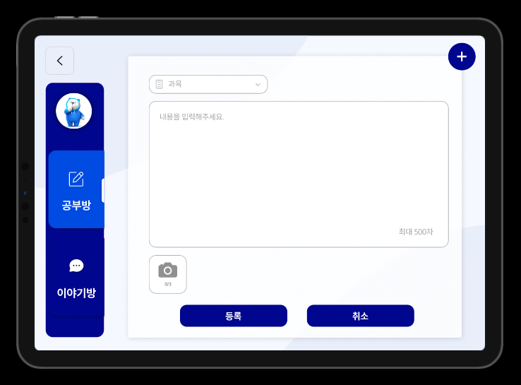|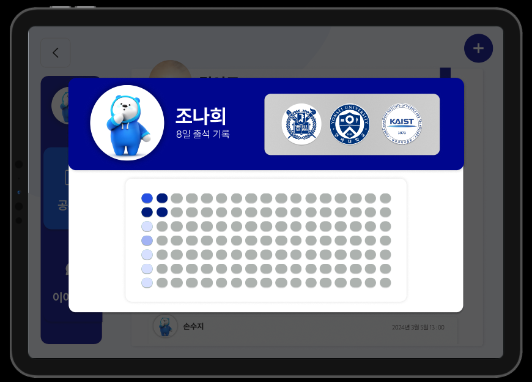|
| 학습관리(1) | 학습관리(2) | 학습관리(3) |
|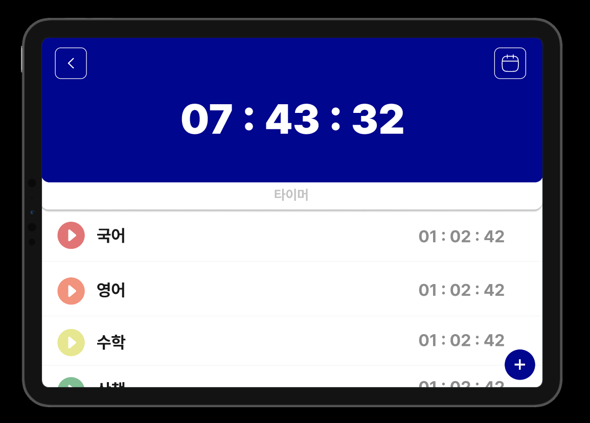|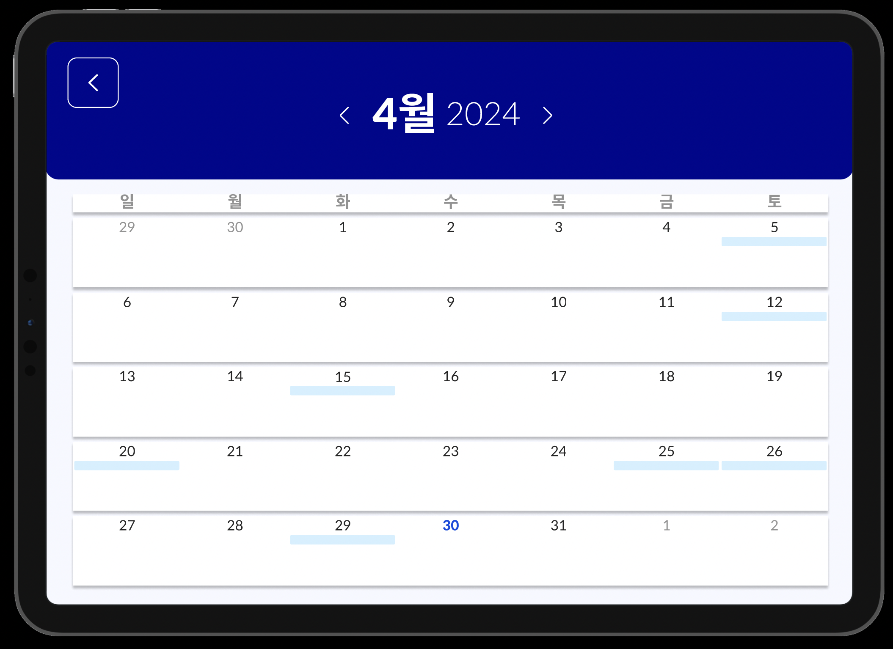|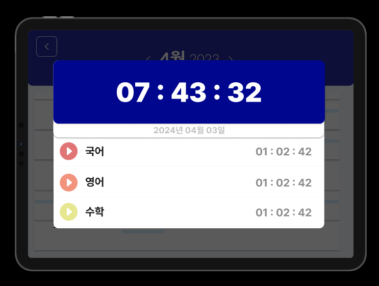|
|        |        |        |

| 카테고리 | 주요 기능 | 기능 정의                                      |
|-------------|---------------|----------------------------------|
| 모의고사 | 모의고사 응시 | • 모의고사 문제, 정답, 해설 파일 제공 </br> • [응시하기] 버튼 탭 후 나오는 시험지 화면에서 타이머, 필기, 마킹 연습을 위한 OMR 카드(Modal Button) 기능 제공 </br> • 모의고사 응시 완료 시 자동 채점 기능 제공 |
| 모의고사 | 모의고사 피드백 | • 시험지 화면에서 선생님의 필기(연필, 형광펜 등)와 댓글 형태의 1:1 피드백 제공 |
| 커뮤니티 | 공부방 | • 게시판을 통해 모르는 질문에 대해 문답 |
| 커뮤니티 | 이야기방 | • 게시판을 통해 입시, 공부방법 등 자유로운 주제로 소통 |
| 학습관리 | 학습 타이머 | • 타이머 기능을 이용하여 과목별 학습 시간과 일일 누적 학습시간 측정 |
| 메인화면 | 학습 확인표 | • 표에 색상 변화(3시간 미만 / 5시간 미만 / 7시간 미만 / 10시간 이상)로 일별 개인 학습시간 확인 |

</br></br>

# 기타

[기획 문서](https://infrequent-morning-c1a.notion.site/2ab54d5d6f074c2da5f2473f134d4779?v=09a4cb89e8fd4ca4b901d13469b0ac26&pvs=4)

[UserFlow](https://infrequent-morning-c1a.notion.site/UserFlow-b25fd902422b48c9b344a29d788ee730?pvs=4)

[ERD Diagram](https://infrequent-morning-c1a.notion.site/ERD-Diagram-231f9332bafc41108cb1ccc74f28d479?pvs=4)

[API 명세서](https://documenter.getpostman.com/view/33630716/2sA35LVKf6#5597fa1e-5f1c-45f2-9d95-fae8dce1192c)

[디자인 - FIGMA](https://www.notion.so/Figma-3318cf32a48d427a86d02240093b9226?pvs=4#111410581aa34f189e1b180669bb6eae)

[팀 활동 - NOTION](https://infrequent-morning-c1a.notion.site/LMS-7c2bd6b04f8947478b59cad8a1cba2f3?pvs=4)

<br/><br/>